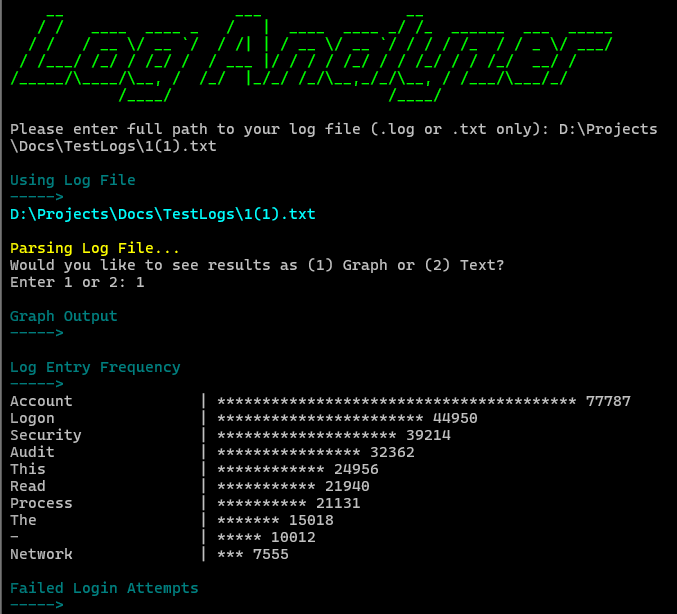

## Log Analyzer



A Python-based log analysis tool that scans system log files for failed login attempts, log frequencies, and other key insights. This tool provides both textual and graphical output options and can export results in JSON or plain text formats.

## 📌 Synopsis

The **Log Analyzer** is designed to help system administrators and security professionals parse log files efficiently. It identifies failed login attempts, frequent log events, and malformed log lines while presenting findings in an easy-to-read format.

## ✨ Features

- **Failed Login Attempt Analysis**: Detects unauthorized access attempts from system logs.
- **Log Entry Frequency Counter**: Provides insights into the most common log events.
- **Graphical and Text Output**: Displays results in an ASCII-based graph or plain text.
- **Malformed Line Detection**: Identifies and counts improperly formatted log entries.
- **Export Options**: Save reports in JSON or plain text formats.
- **Interactive CLI**: User-friendly command-line interface with prompts and error handling.

## 🔥 Why It's Useful

- Enhances security by identifying potential brute-force attacks.
- Helps troubleshoot system issues by analyzing log frequency.
- Saves time by automating log parsing and formatting.
- Provides a structured report for auditing and security analysis.

## 🛠 Requirements

Ensure you have the following installed:

- Python 3.6+
- Required libraries (install via `pip`):

```sh
pip install pyfiglet colorama
```

## 📂 Project Structure

```plaintext
logAnalyzer/
├── logAnalyzer.py    # Main script
├── README.md         # Documentation
└── sample.log        # Example log file (optional)
```

## How to Use

### 1️⃣ Run the Script

```sh
python logAnalyzer.py
```

### 2️⃣ Enter the Log File Path

The script prompts for a log file:

```sh
Please enter full path to your log file (.log or .txt only): /var/log/auth.log
```

### 3️⃣ Choose Output Format

```sh
Would you like to see results as (1) Graph or (2) Text?
Enter 1 or 2: 2
```

### 4️⃣ Example Output

#### **Text Output:**

```plaintext
-----> Log Entry Frequency
Failed password: 45 occurrences
Accepted password: 12 occurrences
-----> Failed Login Attempts
192.168.1.100: 15 failed attempts
192.168.1.200: 10 failed attempts
-----> Skipped Malformed Lines
Malformed lines encountered: 3
```

#### **Graph Output:**

```plaintext
Failed password       | ******************** 45
Accepted password     | ***** 12
192.168.1.100        | *************** 15
192.168.1.200        | ********** 10
Malformed Lines      | *** 3
```

### 5️⃣ Save Report (Optional)

The tool offers an option to save results:

```sh
Would you like to save the report? (yes/no): yes
Choose format - 'text', 'csv' or 'json': json
Report saved as: logAnalyzer_Output.json
```

## 🏆 Contributing

Feel free to submit pull requests or suggest improvements!

## 📜 License

This project is licensed under the MIT License.
